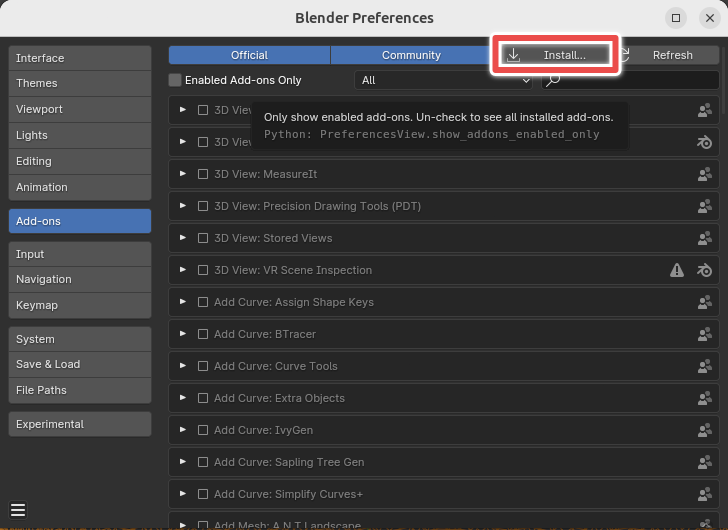

# Jelly Blend - A soft Body simulation addon for Blender


Jelly Blend is a soft body physics engine using state of the art XPBD method. This software is currently WIP, so things will not be stable.

Feature:
- Soft body self collisions
- Collision with colliders
- Damping
- Friction

TODO:
- Simulation caching
- Multi-thread soft body constrain solving
- Multi-thread collsion handling?
- Ability to ping vertex

## Supported Blender version

The addon is tested on the latest blender release (a.k.a. Blender 4.0+).

## Install

Go to the Release page to download zip file for your platform. Then in Blender, go to `Edit->Preference->Add-ons`. From there, click `install` button on the upper right corner and select the zip file. 

**!! Important Notes:** Windows users need special steps to uninstall, please refer to the [Uninstall](#uninstall) section.



after install, the add-on should appear as `Jelly Blend Soft Body`. Enable it by ticking the checkbox.

## Uninstall

Linux user can ignore this section and remove the add-on normally.

As for Windows users, due to the limitation of Blender and Python, a special uninstall method is required. 

1. Disable the add-on
2. Restart Blender
3. Remove the add-on

## Get Started


## Build from source

### Linux

1. Install build tools and dependencies

   - Complier (ex. `gcc`/`clang`)
   - Cmake generator (ex. `make`/`ninja`)
   - Python 3.10
   - `cmake`
   - `git`

   You can install these build tools on Ubuntu by 

   ```
   sudo apt install build-essential cmake git
   ```

   Check your system python version

   ```
   python3 --version
   ```

   If the version is not 3.10.x, you have to setup the correct version of python. I recommends python PPA or `miniconda`.

2. Clone the repo and configure

   ```
   git clone https://github.com/iiiian/jelly_blend.git
   ```

	Create build directory and configure

   ```
   cd jelly_blend
   mkdir build
   cd build
   cmake ..
   ```

	You might need to give `cmake` a hint to the correct python installation

	```
	cmake -DPython_ROOT_DIR="path to your python binary" ..
   ```


3. build and install
   ```
   cmake --build .
   ```

   After the build, there will be a folder called `jelly_blend_addon`. To install the addon, you can move the folder to the Blender addon directory. Which is typically located at `~/.config/blender/3.6/scripts/addons`. Or you can compress the folder to `.zip` format and install the addon from Blender gui.

### Windows

1. Install build tools and dependencies

   - Complier (MSVC)

     I do not suggest using `Mingw`, since you will need to link standard libraries statically.

   - Cmake generator (ex. `make`/`ninja`)
   - Python 3.10
   - `cmake`
   - `git`

   The most convenient way to get these build tools is to install the `Desktop development with C++` kit in Visual Studio. As for python, `miniconda`/`anaconda` is strongly recommended.

2. Clone the repo and configure

   ```
   git clone https://github.com/iiiian/jelly_blend.git
   ```

   Create build directory and configure

   ```
   cd jelly_blend
   mkdir build
   cd build
   cmake ..
   ```

   You might need to give `cmake` a hint to the correct python installation

   ```
   cmake -DPython_ROOT_DIR="path to your python binary" ..
   ```

3. Build and install

   ```
   cmake --build .
   ```

   After the build, there will be a folder called `jelly_blend_addon`. To install the addon, you can move the folder to the Blender addon directory. Or you can compress the folder to `.zip` format and install the addon from Blender gui.

## Credits

- Miles Macklin and Matthias Muller. 2021. A Constraint-based Formulation of Stable Neo-Hookean Materials. In Proceedings of the 14th ACM SIGGRAPH Conference on Motion, Interaction and Games (MIG '21). Association for Computing Machinery, New York, NY, USA, Article 12, 1–7. https://doi.org/10.1145/3487983.3488289

- Teschner, Matthias & Heidelberger, Bruno & Müller, Matthias & Pomeranets, Danat & Gross, Markus. (2003). Optimized Spatial Hashing for Collision Detection of Deformable Objects. VMV’03: Proceedings of the Vision, Modeling, Visualization. 3. 