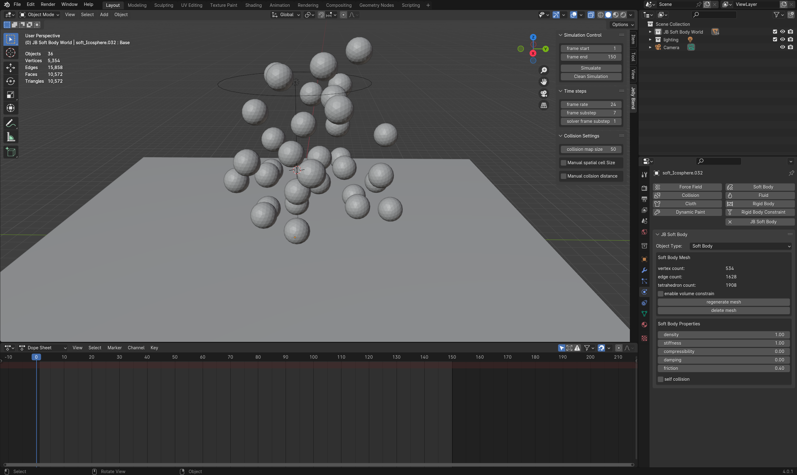
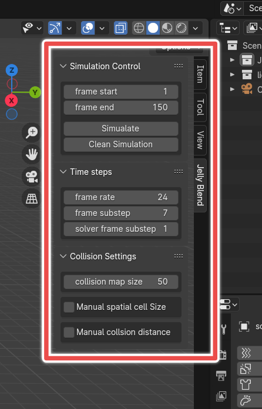

# Play with the demo

Go to the release page and download the demo after installing the add-on, you should be greeted with a window like below.

Right on the top right, you will discover one of the most important panel of the addon.

Here you can control the simulation settings, time steps, and collsion settings.

But for now, lets click `Simulate` and see the magic happened!

To learn how to setup a simulation in detail, please see the next chapter (WIP).